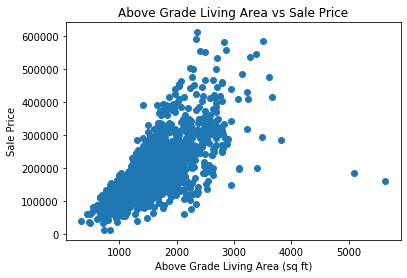
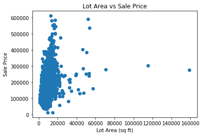
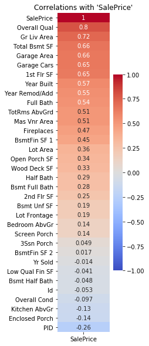
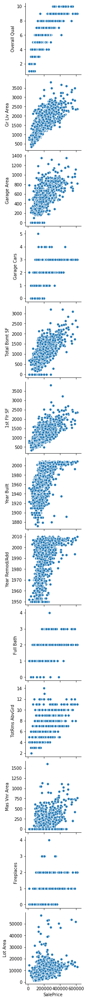
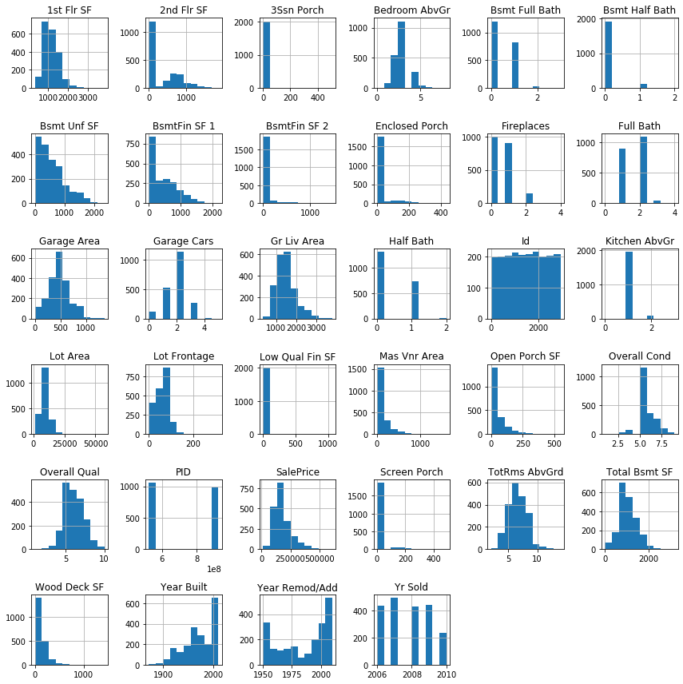
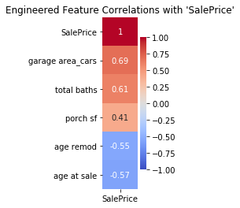

# Estimating Home Prices in Ames, IA

Project completed by Matt Williams

### Problem Statement:

I will be using regression methods to estimate home sale prices in Ames, IA. I will develop several models to predict home prices, and investigate some of the factors that most influence a home's sale price.

---

### Contents:
- [Data Sources & Dictionary](#Data-Sources-&-Dictionary)
- [Data Cleaning](#Data-Cleaning)
- [Feature Engineering](#Feature-Engineering)
- [Exploratory Data Analysis](#Exploratory-Data-Analysis)
- [Modeling](#Modeling)
- [Conclusions and Recommendations](#Conclusions-and-Recommendations)

---

### Data Sources & Dictionary

For this project, I used the datasets provided by Kaggle for the [Ames Iowa housing challenge](https://www.kaggle.com/c/dsi-us-12-project-2-regression-challenge/overview). Links to the original data and my cleaned and altered data are found below:

- [Train set](./datasets/train.csv)
- [Test set](./datasets/test.csv)

Our "train" data consists of over 2,000 observations of homes sold in Ames, IA from 2006 - 2010. There are 81 columns, including our target "SalePrice". This set was used to build a model to predict housing prices.

The "test" data contains the same columns, minus our "SalePrice" target. Once we a model is fit to the "Train" set,

The data dictionary can be found on [Kaggle](https://www.kaggle.com/c/dsi-us-12-project-2-regression-challenge/data).

---

### Data Cleaning

Given the size of the dataset, it was relatively clean, but a few housekeeping measures were taken to ensure errors were not made during modeling:

- 1) Two columns that appeared to be categorical in nature but were integer-type were reclassified to object-type.
- 2) There were many missing values in the datasets but the issues were easy to correct in this case. Five of our columns had a majority of missing values. These five columns were removed.
- 3) For other missing values, it was easy to identify that a missing value corresponded to the characteristic in question not existing for the home (Ex: a missing value for porch square footage corresponded to the home not having a porch). Thus, missing values for categorical variables were imputed with 'NA' and missing values for numerical variables were imputed with 0.
- 4) When looking at "SalePrice" measured against "Above Grade Living Area" and "Lot Area", five observations stood out as being pretty extreme outliers (low sale price for extremely large areas). These rows were removed.

Links to the cleaned data are below:
- [Cleaned Train set](./datasets/train_clean.csv)
- [Cleaned Test set](./datasets/test_clean.csv)

---

### Exploratory Data Analysis

Relationships between the variables and our target were explored here, as well as observing the shape of the distribution of our variables and how some of the more correlated numerical columns interact with our target:

We can observe some linear relationships between the variables and "SalePrice" and begin to develop a strategy for what features to include in a model.

---

### Feature Engineering

Several features were engineered but ultimately only five remained in the dataframe that had better correlation with our target than their component features:

Dummy variable were created for all categorical variables.

Final datasets with cleaned and engineered features are found here:

- [Train set with engineered features used for modeling](./datasets/train_eng.csv)
- [Test set with engineered features used for modeling/Kaggle submissions](./datasets/test_eng.csv)

---

### Modeling

After much experimentation, I will report on four different models: three predictive and one interpretive.

My most predictive models are:

- 1) OLS: my final OLS model produced the my greatest competition score (RMSE = 27236). This model was fairly complex with 91 features and produced a training R^2 of .9142 and a test score of .9105. Thus, there was low variance and the model was not overfit.

- 2) Ridge: The Ridge model training R^2 was .9980 with a test score of .9110. Thus, this model was overfit and is a reason why it did not perform as well in the Kaggle competition. This model did suggest that interactions involving the "Neighborhood" dummy variables were some of the most important to include in a model.

- 3) LASSO: this model was my worst. The training R^2 was virtually 1, while the test score was .8245. This model was very overfit. However, it suggested that "Lot Area" and "Lot Frontage" were two of the three most important variables to include. I did not get a lot of power out of "Lot Frontage" in my own models but it would be worthwhile to see how it could be incorporated.

In reporting to the client, I want a more interpretable model. Thus, I worked backwards from my best OLS model to reduce complexity without sacrificing performance. This model consists of 43 features and produced a R^2 training score of .8953 and a test score of .9006. In reducing complexity by nearly 50 features, the model performance did not decrease too much - the Kaggle RMSE for this model was 29075.32. This can be interpreted as being able to predict a home price about $1,800 less accurately than the more complex model. This is a fair trade-off between accuracy and interpretability of a model.

---

### Conclusions and Recommendations

After evaluating several different approaches to modeling, I've made the following conclusions:

- 1) The factors that have the greatest impact on driving home prices in Ames are overall home quality, neighborhood, and type of home.
- 2) The factors that have the greatest impact on decreasing home prices in Ames are age of the home and how long it has been since the home was remodeled.

This model can be further refined. Here are actions I would take to improve the model:

- 1) Aim to increase model performance while decreasing model complexity
- 2) Use results of the Ridge and LASSO models to incorporate more high-performing features
- 3) Use more current data: predictions for 2020 home sale prices may not be the most accurate with a model built on housing data from 2006 - 2010. Not only must we account for inflation, but the housing market crisis likely had an impact on sale prices during this period.

Based on the models and the factors that most influence a home's sale price, the client should purchase a brand new or newly remodeled 2.5 story home of the highest overall quality and that has the largest overall space - main living area, basement, outdoor ameneties, etc. This will meet the client's desire to purchase the most expensive home possible.
